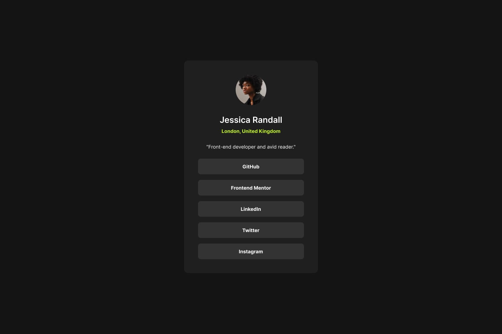

# Social Links Profile

This project is a solution to the **Social Links Profile** coding challenge on [Frontend Mentor](https://www.frontendmentor.io/challenges/social-links-profile-UG32l9m6dQ). The challenge involves building a social links profile component using HTML and CSS.

## Table of Contents

- [Overview](#overview)
- [Screenshot](#screenshot)
- [Links](#links)
- [Built With](#built-with)
- [Getting Started](#getting-started)
    - [Installation](#installation)
    - [Usage](#usage)
- [Contact](#contact)

## Overview

The **Social Links Profile** is a simple yet effective component that allows users to share multiple social media profiles on a single page. This project focuses on:

- Semantic HTML structure
- Responsive design for various devices
- Keyboard accessibility for easy navigation

## Screenshot



## Links

- [Live Demo](https://gar-st.github.io/social-links-profile/) *(Replace with live site URL)*
- [Frontend Mentor Challenge](https://www.frontendmentor.io/challenges/social-links-profile-UG32l9m6dQ)

## Built With

- **Semantic HTML5 markup**
- **CSS custom properties**
- **Flexbox**
- **CSS Grid**
- **Mobile-first workflow**

## Getting Started

To get a local copy up and running, follow these steps.

### Installation

1. **Clone the repository:**
   ```bash
   git clone https://github.com/Gar-st/social-links-profile.git
   ```
2. **Navigate to the project directory:**
   ```bash
   cd social-links-profile
   ```

### Usage

Open `index.html` in your preferred web browser to view the social links profile.

## Contact

- **GitHub**: [Gar-st](https://github.com/Gar-st)  
